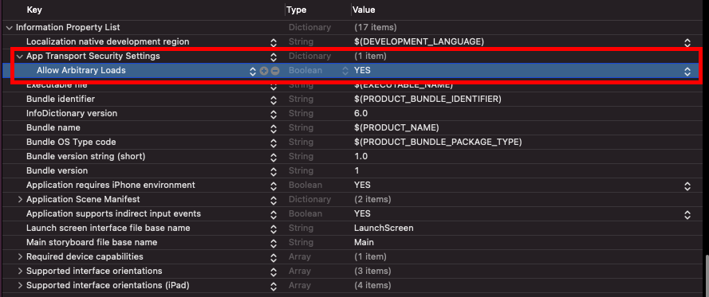
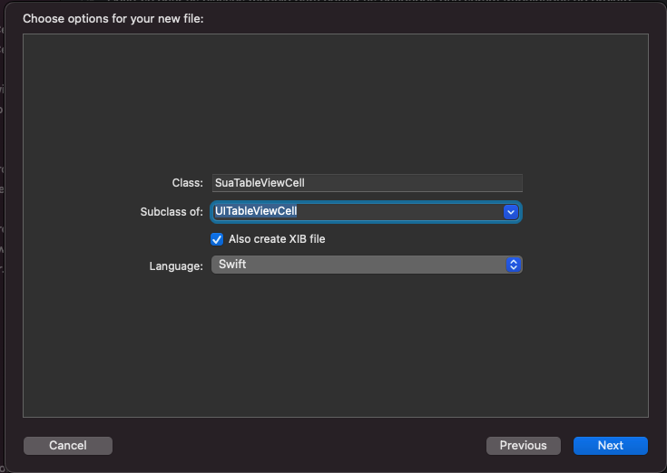
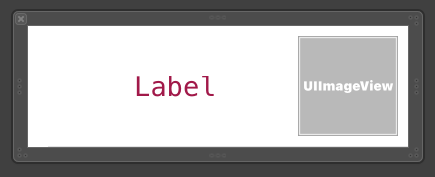
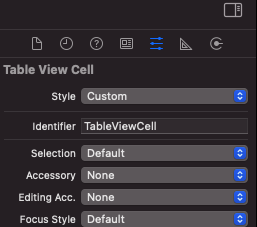

# iOS starter Guide
###### Objetivo do projeto

Projeto simples demonstrando o inicio do desenvolvimento iOS

### Tecnologias Usadas/Estudadas
- iOS
- [Swift](https://www.apple.com/br/swift/)
- [Alamofire](https://github.com/Alamofire/Alamofire)
- [Cocoapods](https://cocoapods.org/)
- [PokeApi](https://pokeapi.co/)

## TableView Stroryboard

#### Adicionando e ligando tableview do storyboard ao código Swift
[Ligações no Stroy board para criar o table view](https://github.com/BersonCrios/pokedex-ios/blob/main/Pokedex/imgs/storyboard-init-table.png)

No view Controller adiciona a linha que é onde será ligado o story board ao código swift
```swift
 @IBOutlet var tableView: UITableView!
```

Extende o UITableViewDelegate e o UITableViewDataSource na classe
```swift
class ViewController: UIViewController, UITableViewDelegate, UITableViewDataSource {
```

Adiciona o delegate e o datasource na função viewDidLoad
 ```swift
 override func viewDidLoad() {
     super.viewDidLoad()
     
     tableView.delegate = self
     tableView.dataSource = self
 }
 ```
 
 ##### Funções do delegate
 📄 [Doc - didSelectRowAt](https://developer.apple.com/documentation/uikit/uitableviewdelegate/1614877-tableview) 
  ```swift
  func tableView(_ tableView: UITableView, didSelectRowAt indexPath: IndexPath) {

  }
```

##### Funções do datasource 
📄 [Doc - numberOfSections](https://developer.apple.com/documentation/uikit/uitableviewdatasource/1614860-numberofsections) 
```swift
func numberOfSections(in tableView: UITableView) -> Int {
    return 1
}
```
📄 [Doc - numberOfRowsInSection](https://developer.apple.com/documentation/uikit/uitableviewdatasource/1614931-tableview) 
```swift
func tableView(_ tableView: UITableView, numberOfRowsInSection section: Int) -> Int {
    return items.count
}
```
📄 [Doc - cellForRowAt](https://developer.apple.com/documentation/uikit/uitableviewdatasource/1614861-tableview) 
```swift
func tableView(_ tableView: UITableView, cellForRowAt indexPath: IndexPath) -> UITableViewCell {
    //
}
```
## Iniciando o cocoapods

Para iniciar, precisamos fechar todo o projeto, e em seguida, abri-lo no terminal

*Obs: [Caso ainda não tenha, instale o cocoapods, que é o gerenciamento de depêndencias usado para instalar as pods](https://cocoapods.org/)
#### No terminal
1
```powershell
    pod init
```

2
```powershell
    pod install
```

Para abrir o projeto, clique no arquivo 
```
✅ Pokedex.xcworkspace
```
ao invés do que seria o padrão 
 ```
 ❌ Pokedex.xcodeproj
```
Abrindo o Podfile (Pods/Podfile), adicione a lib do alamorfire abaixo da linha !use_frameworks

```
pod 'Alamofire', '~> 5.2'
```
Rode novamente o comando no terminal

```powershell
    pod install
```

E pronto, ja podemos usar a lib de requisição http Alamorfire.


## Utilizando o alamofire
Primeiramente, devo importar o Alamofire na classe em que farei a chamada do mesmo
```swift
import Alamofire
```

Crio uma variável contendo a URL base da minha api 
```swift
var URL_BASE = "https://pokeapi.co/api/v2/"

```

Para realizar a requisição, que no exemplo a baixo é um get, deve-se usar AF.request, nesse caso irá retornar uma lista com os pokemons
```swift

AF.request(URL_BASE + "/pokemon")
    .validate()
    .responseDecodable(of: Pokemon.self) { (response) in
  guard let pokemons = response.value else { return }
        self.items = pokemons.results
}
```

Deve-se criar as classes modelo para conter as entidades que seram trabalhadas no projeto

Result.swift
```swift
struct Result: Decodable {
  let name: String
  let url: String
  
  enum CodingKeys: String, CodingKey {
    case name
    case url
  }
}
```
[Aqui você pode ver a diferença e definição de decodable e Encodable](https://pt.stackoverflow.com/questions/404533/qual-%C3%A9-a-diferen%C3%A7a-entre-codable-e-decodable)


## Problemas com Cleartexttrafic(Http)
Caso precise usar um endpoint onde o link seja http e não https você precisa realizar uma configuração no arquivo info.plist, conforme a imagem abaixo: 



## Criando uma TableViewCell personalizada

1. Primeiramente, deve-se Criar a classe, marcando a opção de criar xib, que com isso ira criar a classe swift e o layout da celular



2. Dentro do arquivo .xib pode-se manipular e criar o layout da celula como desejar



3. Seguindo, deve-se adicionar um identificador para o layout xib criado



4. Lembando de sempre fazer as ligações dos elementos do layout dentro da classe da tableviewcell.swift

```swift
    @IBOutlet var name: UILabel!
    @IBOutlet var photo: UIImageView!
```

Agora, passamos a classe que tem a tableview que irá ustilizar a celula criada

5.  devemos inicializar o nib/xib criado no viewDidLoad()
 
 ```swift
 override func viewDidLoad() {
     super.viewDidLoad()
     
     //nib da TableViewCell
     let nib = UINib(nibName: "nome-dado-no-passo-3", bundle: nil)
     suaTableView.register(nib, forCellReuseIdentifier: "nome-dado-no-passo-3")
 }
```

6. No cellForRowAt posso fazer o uso da mesma

 ```swift
 func tableView(_ tableView: UITableView, cellForRowAt indexPath: IndexPath) -> UITableViewCell {
     let cell = tableView.dequeueReusableCell(withIdentifier: "nome-dado-no-passo-3", for: indexPath) as! ClasseDeTableViewCell
    
     return cell
 }
```

👷🏾 Estamos em contrução, em breve teremos mais e mais partes em nosso humilde tutorial 
